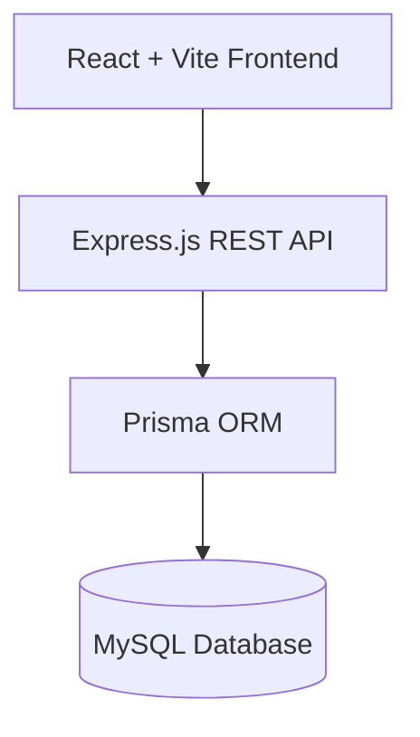
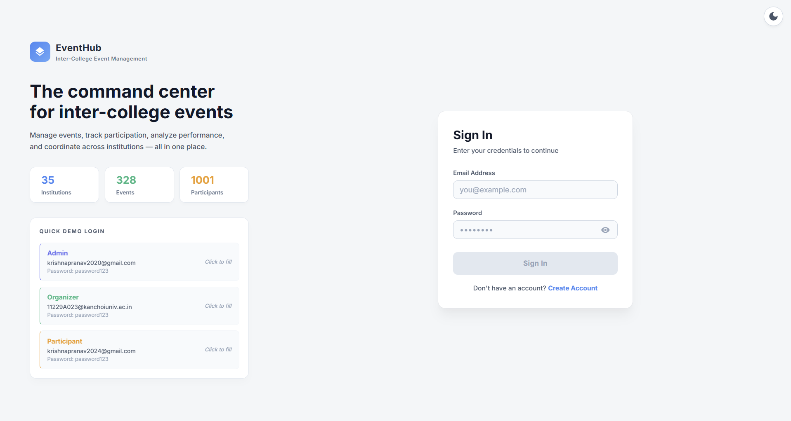
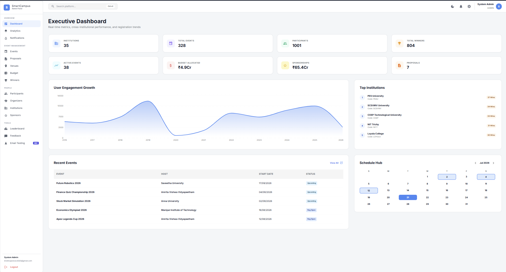
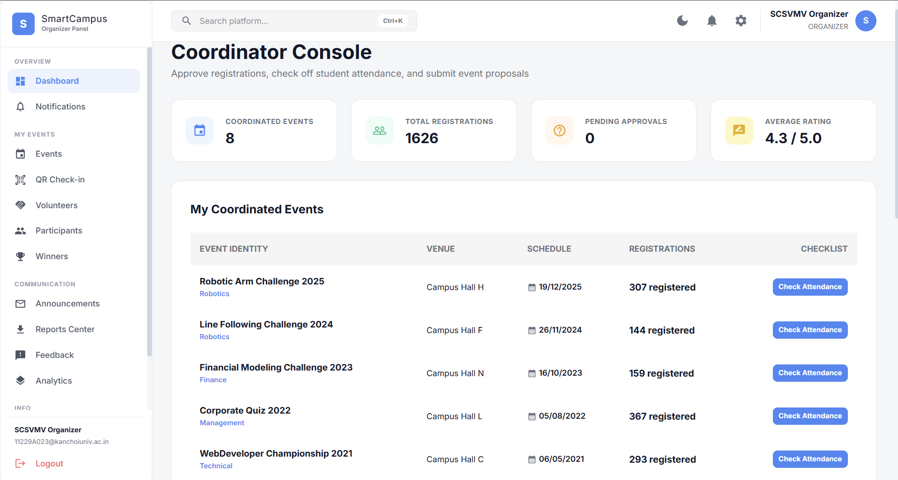
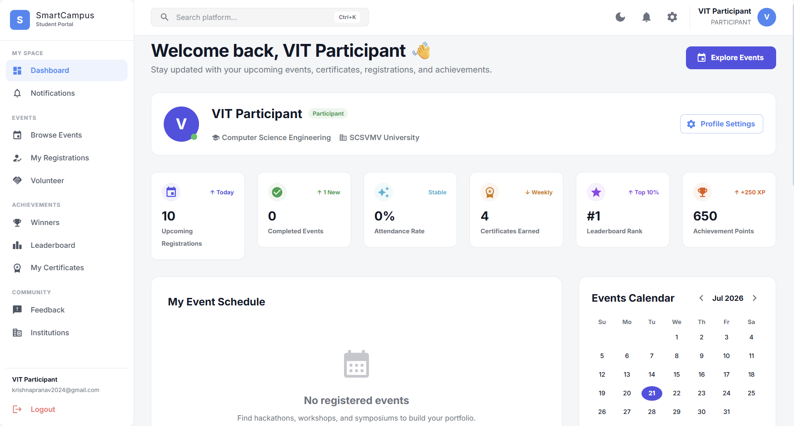
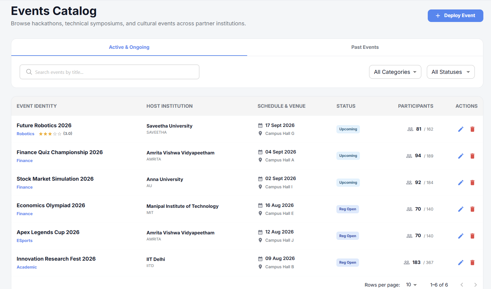
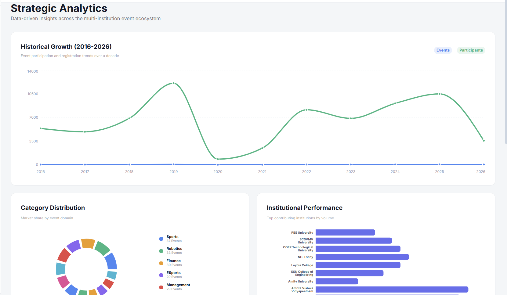
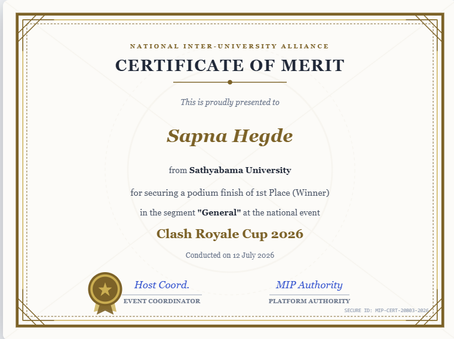
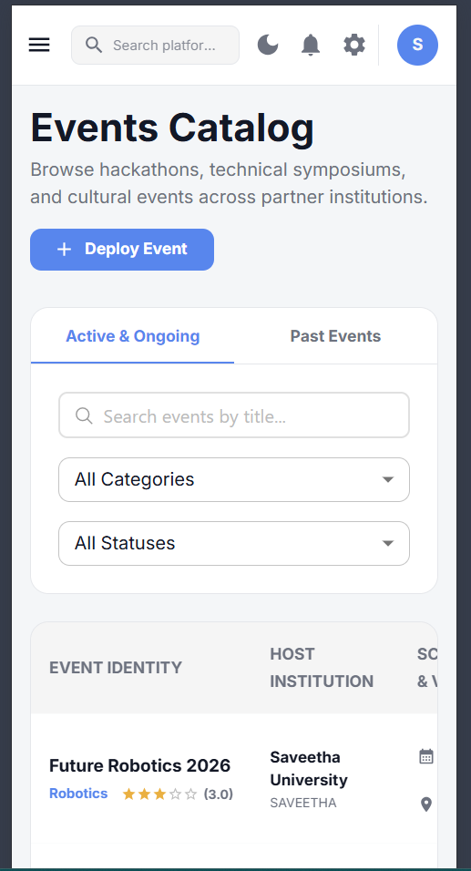

# 🎓 Smart-Campus


<p align="center">
  
</p>

<h1 align="center">🎓 Smart-Campus</h1>

<h3 align="center">
A Production-Ready Full-Stack Multi-Institution Event Management Platform
</h3>

<p align="center">
Manage Events • Competitions • Certificates • Analytics • Budgets • Leaderboards
</p>

---

## 📖 Overview

**Smart-Campus** is a modern, production-ready event management platform designed for universities and educational institutions to efficiently organize, manage, and monitor inter-collegiate events.

The platform supports multiple user roles including **Administrators, Event Organizers, and Students**, providing a centralized system for managing competitions, registrations, attendance, winners, certificates, budgets, analytics, notifications, and institutional leaderboards.

Built with a scalable architecture using **React, Node.js, Express, Prisma ORM, and MySQL**, Smart-Campus demonstrates modern full-stack development practices suitable for real-world deployments.

---

# ✨ Features

## 👨‍💼 Administrator

- Dashboard with KPI Cards
- Institution Management
- User Management
- Event Approval
- Budget Management
- Reports & Analytics
- Digital Certificate Management
- Leaderboard Management
- Notification Center
- Email Management

---

## 👨‍🏫 Event Organizer

- Create & Manage Events
- Event Proposal Workflow
- Participant Management
- Attendance Tracking
- Winner Declaration
- Budget Tracking
- Event Analytics
- Email Announcements

---

## 👨‍🎓 Student

- Register for Events
- Browse Upcoming Events
- Event Bookmarks
- QR Check-in
- Download Certificates
- View Achievements
- Notifications
- Event Reviews & Ratings
- Volunteer Registration
- Personal Dashboard

---

## 🔒 Common Features

- JWT Authentication
- Role-Based Authorization
- Responsive UI
- Search & Filters
- Material UI Components
- REST API
- Email Notifications
- Prisma ORM
- Secure Password Hashing
- MySQL Database

---

## 🏗️ System Architecture


---

# 📸 Application Screenshots

## Login



---

## Admin Dashboard



---

## Organizer Dashboard



---

## Student Dashboard



---

## Event Details



---

## Analytics Dashboard



---

## Digital Certificate



---

## Mobile Responsive View



---

# 🛠 Technology Stack

| Layer | Technology |
|--------|------------|
| Frontend | React + Vite |
| UI Framework | Material UI (MUI v5) |
| Styling | CSS + Emotion |
| Backend | Node.js |
| Framework | Express.js |
| Database | MySQL |
| ORM | Prisma ORM |
| Authentication | JWT + bcryptjs |
| Email | Nodemailer |
| API | REST API |
| Version Control | Git & GitHub |

---

# 🏗 Project Architecture

```
                    React + Vite
                         │
                         ▼
               Express REST API
                         │
                         ▼
                    Prisma ORM
                         │
                         ▼
                     MySQL Database
```

---

# 📂 Project Structure

```
Smart-Campus
│
├── assets/
│   └── banner.png
│
├── screenshots/
│
├── backend/
│   ├── prisma/
│   ├── src/
│   ├── .env.example
│   ├── package.json
│   └── package-lock.json
│
├── frontend/
│   ├── src/
│   ├── package.json
│   ├── vite.config.js
│   └── index.html
│
├── README.md
└── .gitignore
```

---

# ⚙ Installation

## Clone Repository

```bash
git clone https://github.com/krishnapranav023/Smart-Campus.git
```

---

## Backend

```bash
cd backend

npm install

cp .env.example .env

npx prisma migrate dev

npx prisma db seed

npm run dev
```

---

## Frontend

```bash
cd frontend

npm install

npm run dev
```

---

# 🔑 Environment Variables

Create a `.env` file inside the backend folder.

```env
DATABASE_URL=

JWT_SECRET=

EMAIL_USER=

EMAIL_PASS=

PORT=5000
```

---

# 📊 Major Modules

- Authentication
- User Management
- Institution Management
- Event Management
- Proposal Workflow
- Registration System
- Attendance Tracking
- Budget Management
- Analytics Dashboard
- Notifications
- QR Attendance
- Winner Management
- Digital Certificates
- Leaderboard
- Feedback & Ratings
- Volunteer Management
- Email Announcement System

---

# 🚀 Future Enhancements

- AI Event Recommendation System
- Mobile Application
- Push Notifications
- Payment Gateway
- Event Live Streaming
- Chat Module
- Multi-language Support
- Cloud Deployment
- Docker Support
- CI/CD Pipeline

---

# 👨‍💻 Developed By

**Krishna Pranav**

Software Developer

GitHub: https://github.com/krishnapranav023

---

# ⭐ Support

If you found this project useful,

⭐ Star this repository on GitHub.

---

# 📜 License

This project is licensed under the MIT License.